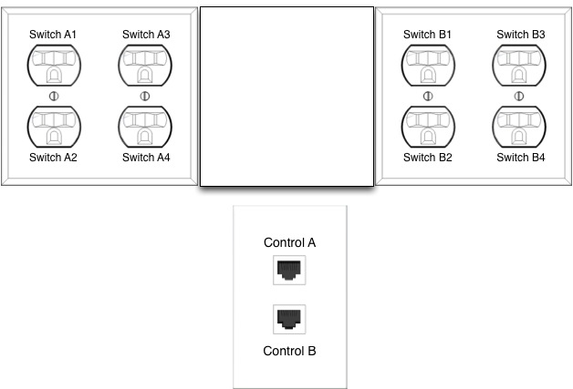
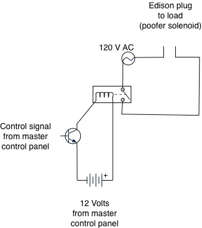

# General Overview

Control packs are an easy way to allow an Arduino microcontroller to
control higher voltage circuits.

The edison plugs are connected to 8 separate relays that reside above
the ethernet jacks. The relays are powered and controlled via an
external Arduino micro controller or manual switches. Control A and
Control B are ethernet cabling connections to the Arduino or manual
switches. 

Note that this is not running an ethernet network. The ethernet lines
are just a convenient way to run multiple wires.

# Ethernet Wiring Color Guide

| wire         | purpose  |
| ------------ | -------- |
| blue         | 12 volts |
| blue strip   | 12 volts |
| green        | ground   |
| green strip  | ground   |
| orange       | signal 1 |
| orange strip | signal 2 |
| brown        | signal 3 |
| brown strip  | signal 4 |

# Basic Circuit

When a signal line is set to high (+12v) the relay is energized and
power is fed to the associated edison plug labeled.
